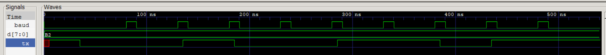
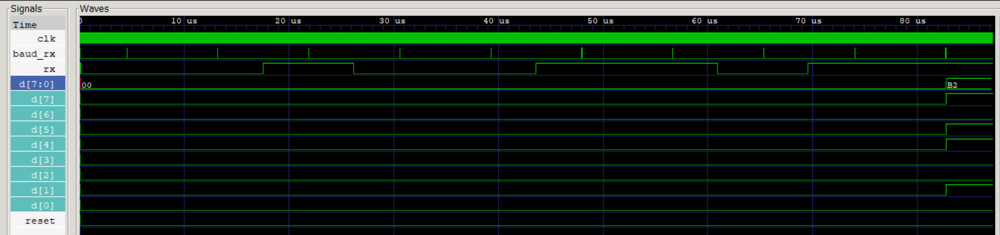

# UART Verilog RTL

A basic 8N1 UART transmitter and receiver implemented in Verilog RTL and verified through simulation using Icarus Verilog and GTKWave.

## Overview

This project implements a UART communication interface consisting of:

- UART Transmitter (TX)
- UART Receiver (RX)
- TX baud-rate generator
- RX baud-rate generator
- Start-bit detection and validation
- Stop-bit validation
- LSB-first data transmission
- Verilog testbenches
- VCD waveform generation
- GTKWave waveform verification

The design uses a single 100 MHz system clock and generates timing enables for approximately 115200 baud operation.

## UART Configuration

| Parameter | Value |
|---|---|
| System Clock | 100 MHz |
| Baud Rate | ~115200 baud |
| Data Bits | 8 |
| Parity | None |
| Stop Bits | 1 |
| Frame Format | 8N1 |
| Data Order | LSB First |

### What is 8N1?

8N1 means:

- **8** → 8 data bits
- **N** → No parity bit
- **1** → 1 stop bit

A UART frame is therefore:

```text
Idle | Start | D0 D1 D2 D3 D4 D5 D6 D7 | Stop
  1     0       <---- 8 data bits ---->    1
```

The data bits are transmitted **LSB first**.

## System Architecture

The UART consists of independent TX and RX paths.

```text
                       ┌───────────────────┐
                       │ TX Baud Generator │
                       └─────────┬─────────┘
                                 │ baud_tick
                                 ▼
Parallel Data ────────────────► UART TX ─────► TX


                       ┌───────────────────┐
                       │ RX Baud Generator │
                       └─────────┬─────────┘
                                 │ baud_rx
                                 ▼
RX ───────────────────────────► UART RX ─────► Data
                                 │
                                 └────────────► busy
```

The design uses baud-rate enable pulses rather than generating a separate clock from the baud signal.

## Baud Rate Generation

For a 100 MHz system clock and approximately 115200 baud:

```text
100,000,000 / 115,200 ≈ 868 clock cycles per UART bit
```

For RX start-bit validation, approximately half a bit period is used:

```text
868 / 2 ≈ 434 clock cycles
```

The RX samples the START bit after approximately 434 clock cycles and then samples subsequent bits at approximately 868-clock-cycle intervals.

## UART Transmitter

The transmitter accepts an 8-bit parallel data input and serializes it using a 10-bit shift register.

The transmission sequence is:

```text
START → D0 → D1 → D2 → D3 → D4 → D5 → D6 → D7 → STOP
```

Data is transmitted LSB first.

### TX Flow

```text
IDLE
  │
  │ start
  ▼
LOAD FRAME
  │
  ▼
START BIT
  │
  ▼
D0 → D1 → D2 → D3 → D4 → D5 → D6 → D7
  │
  ▼
STOP BIT
  │
  ▼
IDLE
```

## UART Receiver

The receiver detects a potential START bit when RX goes LOW while the UART is idle.

It then waits approximately half a bit period and validates the START bit.

### START Validation

```text
RX goes LOW
     │
     ▼
Potential START
     │
     │ ~434 clocks
     ▼
Sample RX
     │
   ┌─┴─┐
   │   │
  LOW HIGH
   │   │
   ▼   ▼
Valid  Invalid
START  START
```

If RX is still LOW, the START bit is considered valid and data reception begins.

If RX is HIGH, the LOW pulse is treated as a false START and the receiver returns to the idle state.

### Data Reception

After validating the START bit, the receiver samples the eight data bits at approximately one-bit intervals:

```text
D0 → D1 → D2 → D3 → D4 → D5 → D6 → D7
```

The received bits are stored in a SIPO-style register.

Since UART transmits data LSB first:

```text
sipo[1] = D0
sipo[2] = D1
sipo[3] = D2
...
sipo[8] = D7
```

The original 8-bit data is reconstructed using:

```verilog
d <= sipo[8:1];
```

### STOP Validation

After receiving D7, the receiver samples the STOP bit.

UART requires the STOP bit to be HIGH:

```text
RX = 1 → valid frame
RX = 0 → invalid frame / framing error
```

If the STOP bit is valid, the received byte is transferred to the output.

## Simulation

The design was simulated using:

- Icarus Verilog
- GTKWave

The transmitter and receiver were tested using:

```text
Data = 0xB2
```

### UART TX Test

For:

```text
0xB2 = 10110010
```

the UART transmits the data LSB first:

```text
START  D0 D1 D2 D3 D4 D5 D6 D7  STOP
  0     0  1  0  0  1  1  0  1    1
```

### UART RX Test

The receiver was provided with the same UART frame and successfully reconstructed:

```text
Received data = B2
```

## Waveforms

### UART Transmitter



### UART Receiver



## Files

| File | Description |
|---|---|
| `uart_tx.v` | UART transmitter |
| `uart_rx.v` | UART receiver |
| `baud_gen.v` | TX baud-rate generator |
| `baud_gen_rx.v` | RX baud-rate generator |
| `tb_uart_tx.v` | TX testbench |
| `tb_uart_rx.v` | RX testbench |

## Tools

- Verilog HDL
- Icarus Verilog
- GTKWave

## Verification

The design was verified through RTL simulation.

The testbenches generate VCD waveform files that were inspected using GTKWave to verify:

- UART frame generation
- START bit
- LSB-first data transmission
- STOP bit
- RX sampling timing
- START-bit validation
- STOP-bit validation
- Correct reconstruction of received data

## Current Limitations

This is a basic UART implementation intended for RTL learning and simulation.

The current receiver uses center-of-bit sampling rather than 16× oversampling.

Hardware validation on an FPGA has not yet been performed.

## Future Improvements

Planned improvements include:

- 16× UART oversampling
- Majority-vote sampling
- `rx_valid` signal
- Explicit framing-error output
- FPGA hardware validation
- Improved baud-rate accuracy

## Author
Aarav Singh

